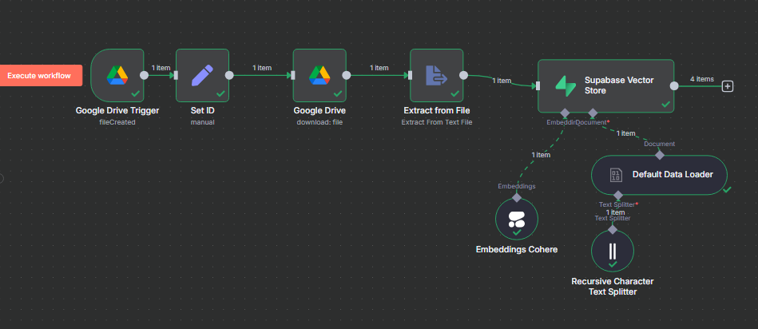
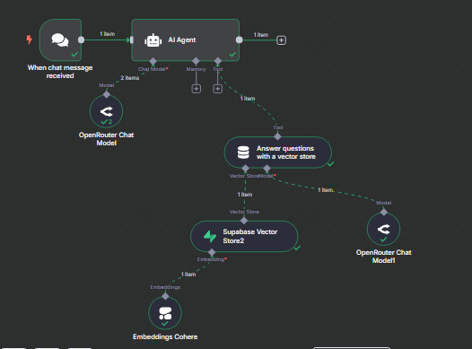

# 📄 Resume-QA Chatbot (RAG Powered)

This project implements a **Resume-based Retrieval-Augmented Generation (RAG)** chatbot. It extracts text from uploaded resume documents (e.g., `.docx`), converts them to `.txt`, creates embeddings using **Cohere**, stores them in a **Supabase Vector Store**, and finally allows users to query the resume through a conversational **AI Agent**.

---

## 🚀 Features

- ✅ Upload resume (DOCX format) from **Google Drive**
- ✅ Extract and preprocess text
- ✅ Create embeddings using **Cohere**
- ✅ Store embeddings in **Supabase Vector Store**
- ✅ Use **PostgreSQL** for chat memory
- ✅ Chat with the AI to ask questions based on resume contents
- ✅ Powered by **OpenRouter Chat Model** with a vector store-backed RAG pipeline

---

## 🧠 Workflow 1: Resume Data Ingestion and Vector Store Indexing

### 🔁 Step-by-Step

1. **Google Drive Trigger** – Watches for new resume uploads.
2. **Set ID** – Manually assigns the Google Drive file ID.
3. **Download File** – Pulls the uploaded document.
4. **Extract From File** – Converts `.docx` to plain `.txt`.
5. **Split Text** – Uses `RecursiveCharacterTextSplitter` to chunk data.
6. **Generate Embeddings** – Via `Embeddings Cohere`.
7. **Store in Supabase Vector Store** – Embeddings are indexed here for semantic search.

### 📸 Screenshot

---

## 🤖 Workflow 2: Question Answering via Chat

### 🔁 Step-by-Step

1. **Chat Trigger** – Starts when a user sends a message.
2. **AI Agent** – Handles conversational context using PostgreSQL memory.
3. **Answer with Vector Store** – Uses Supabase Vector Store to semantically search resume content.
4. **OpenRouter Chat Model** – Provides conversational answers.

### 📸 Screenshot

---

## 💾 Technologies Used

| Feature                  | Stack/Tool                |
|--------------------------|---------------------------|
| File Upload Trigger      | Google Drive              |
| File Conversion          | Extract from Text         |
| Text Chunking            | RecursiveCharacterTextSplitter |
| Embedding Generation     | Cohere                    |
| Vector Store             | Supabase                  |
| Chat Memory              | PostgreSQL                |
| LLM Chat Model           | OpenRouter                |
| RAG Query Handler        | AI Agent with Tool Call   |

