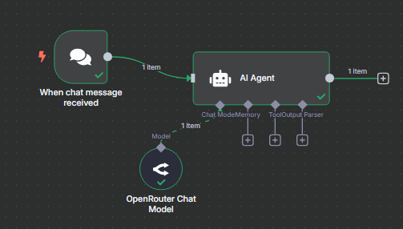
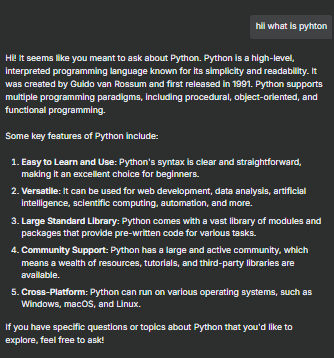

# Hello World Agent 

This project demonstrates the implementation of a simple chatbot agent built using the [n8n](https://n8n.io/) automation platform and the GPT-3.5 Turbo model accessed through [OpenRouter](https://openrouter.ai/). The goal was to create a cost-effective, flexible, and easy-to-deploy conversational agent.

## 📌 Project Overview

- **Platform:** n8n (Visual Workflow Automation Tool)
- **LLM Provider:** OpenRouter
- **Model Used:** GPT-3.5 Turbo
- **Purpose:** Build a basic chatbot using a free or low-cost LLM API integration

## 🔧 Technologies Used

- **n8n Workflow Nodes:**
  - Chat Trigger
  - AI Agent (configured with OpenRouter API)
- **Model Integration:**
  - `gpt-3.5-turbo` via OpenRouter API
- **Input/Output Handling:** Managed directly inside the AI Agent node

## 🧠 Memory and Context Handling

- Basic session context is maintained through message history passed into the AI Agent.
- Persistent memory is not available natively in n8n but can be added in extended setups.

## 📈 Pros and Cons of OpenRouter

### Pros
- Free access to models for testing and prototyping
- Easy API integration with n8n
- Supports a variety of LLM providers and models
- Fast and reliable performance during testing

### Cons
- Rate limits and credits may apply
- Documentation is less comprehensive than larger platforms
- Manual configuration needed for model switching

## 🖼️ Workflow Diagram

## 💬 Sample Output

Here is an example of the chatbot's response when asked a basic programming question:

## 📌 Summary

This project proves that a basic chatbot can be efficiently built using OpenRouter's GPT-3.5 Turbo and n8n. It is a low-cost, beginner-friendly option that integrates easily and delivers stable, high-quality results.

## 📎 Recommendations

- Monitor token usage and credit availability if deployed at scale.
- Expand memory using external storage for more complex interactions.
- Experiment with other models from OpenRouter for domain-specific tasks.

---

**Prepared by:** Shubh Marwdai  
**Project:** Hello World Agent  
**Platform:** n8n + OpenRouter  
**Model Used:** GPT-3.5 Turbo
